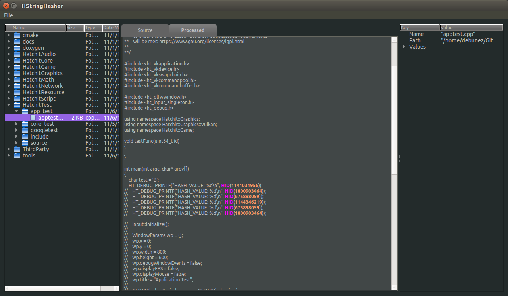

# Tools

Various build and preprocessing tools required for developing Hatchit

---

### HStringHasher (version 0.1)

This application is developed as part of <b>HatchitEditor</b> but is required for developing Hatchit.

####Functions
* Parses source files for use of <b>`HID()`</b> macro
* Utilizes <b>FNV</b> hash algorithm to calculate hash value
* Processes source files and outputs modified file with hash value
    * For example: `HID("Light")` will be replaced with `HID(1141031956)`
    
####Purpose
* Allows the engine to avoid using string values for id
* Increases runtime performance due to faster integer checks
* Could also be used for implementing Localization system

####Usage

* Arguments
  * `-i [input source directory]`
  * `-o [output source directory]`
  
  ####Example Usage
    
      -- Parse source in Hatchit
      -- Ouput result to current directory
      
      HStringHasher -i Hatchit/source -o .

####GUI

Note: There is a GUI mode available when running the hash tool.

* Allows for visualizing the source input and output before processing
* Easy of use for those unwilling to run from command line.

